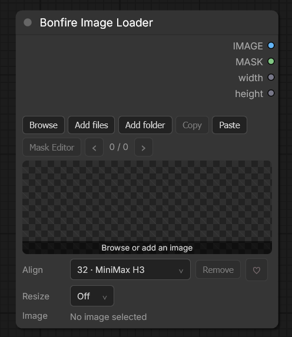
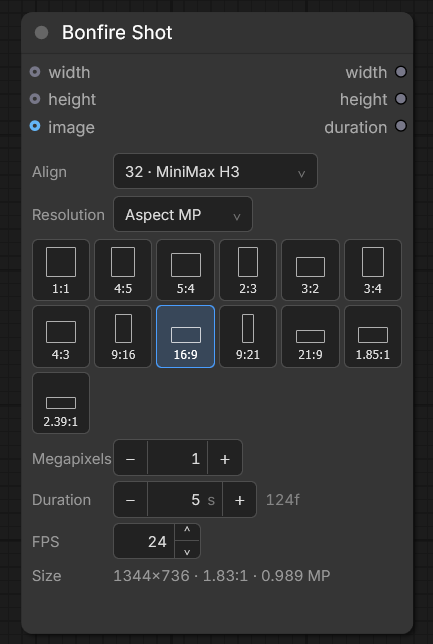

# Bonfire

Two nodes for ComfyUI.

One holds your pictures, in the order you picked them.

The other tells the model what size to make, and how many frames that is.



## Bonfire Image Loader

ComfyUI's own loader shows every file in `input`, sorted by name. If you want to run five pictures in a particular order, that list fights you.

This one remembers the order you put them in.

**How to put pictures in**

- **Browse** opens your `input` folder. Search, sort by date / name / size (the little arrow flips newest/oldest), favourite the ones you like, pick some, add them.
- **Add files** picks pictures from anywhere on your computer.
- **Add folder** picks a whole folder. It takes the pictures inside, including pictures in folders inside that folder.
- Drop pictures **or a folder** on the node.
- **Paste** takes what is on the clipboard.

### Clipboard permission note

The **Paste** button needs clipboard permission from the browser:

- **Chrome / Chromium:** allow clipboard access for the ComfyUI page when prompted.
- **Firefox:** use the two-step permission flow — click **Paste**, allow clipboard
  access, then click **Paste** again.

Same picture twice? It will not add it again. It just jumps to the one you already have.

Then walk through them with the arrows, or the left/right keys while the node is selected.

**What the rest of the buttons do**

- **Align** is “make this fit the model.” `32 · MiniMax H3` is the default. It sizes the picture the way H3 likes it. A plain “multiple of 8/32/64” only rounds the size. It does not snap unless you pick a model.
- **Resize** is extra, if you want to be specific: off, megapixels, long edge, fit, or crop.
- **Copy** puts the current picture on the clipboard.
- **Mask Editor** is ComfyUI's own painter. Paint, save, the preview updates.
- **Remove** takes the picture out of this list. The file stays on disk.
- In Browse, delete really deletes the file. It asks first.

Gives you: `IMAGE`, `MASK`, `width`, `height`.



## Bonfire Shot

This one never changes your picture. It answers a different question: what are you asking the model to make?

**Size.** Pick a shape (the little boxes are the real aspect ratios), then how many megapixels. Or type a size. Or **Match input** to copy whatever you plug in. The line at the bottom is the real size you will get.

**Length.** Duration is in seconds. Next to it is how many frames that is, like `124f`. FPS sits underneath.

One thing about MiniMax H3: it does not take every frame count. Only a few legal ones. So 5 seconds at 24 FPS becomes 124 frames, which is a hair over 5 seconds. The node shows you that so it cannot surprise you later.

Gives you: `width`, `height`, `duration`.

`duration` is a frame count, not seconds. That is what the H3 latent node wants in its length box.

## Install

In ComfyUI Manager, search for **Bonfire**.

Or by hand:

```bash
git clone https://github.com/DaemonSK/ComfyUI-Bonfire ComfyUI/custom_nodes/ComfyUI-Bonfire
```

Restart ComfyUI. Nothing to pip install. It uses what ComfyUI already has.

## Licence

MIT. See [LICENSE](LICENSE).
